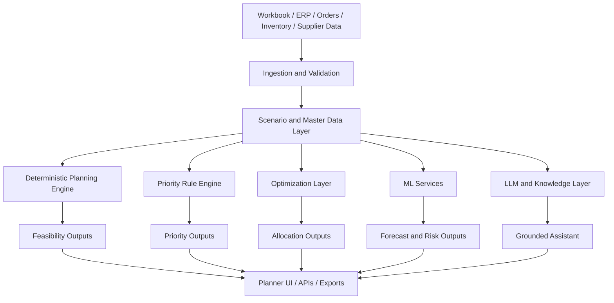

# C&S Electrics Pitch Deck

This document is a client-facing presentation script for `C&S Electrics`.

It is designed to help position ForgeBoard as:

- a practical manufacturing decision platform
- a serious AI-assisted planning system
- a foundation that can scale from pilot to enterprise rollout

Use this document as:

- a slide deck outline
- a speaker-note guide
- a strategic narrative for client discussion

## Presentation Objective

The objective is not only to show a polished interface.

The objective is to make C&S Electrics feel that:

- you understand the planning problem at operational depth
- you understand the commercial and customer-impact side of planning
- you know where deterministic planning, AI, ML, and optimization each fit
- your team can build this as a long-term platform, not only a demo

## Positioning Rule

Do not pitch ForgeBoard as:

- just a dashboard
- just a chatbot
- just Excel automation

Pitch ForgeBoard as:

`An AI-assisted manufacturing decision platform that converts planning inputs into explainable production, fulfillment, and material-prioritization decisions.`

## How To Sound Strong in the Meeting

Your strongest posture is:

- business-first
- technically credible
- controlled
- practical

Do not sound flashy.

Do sound like:

- you know manufacturing planning reality
- you know how enterprise AI should be controlled
- you know how to evolve this in phases

---

## Slide 1. Title Slide

### Slide title

`ForgeBoard for C&S Electrics`

### Subtitle

`AI-assisted Production Feasibility, Fulfillment, and Material Prioritization`

### What to say

`Today we are showing a practical AI-assisted planning platform designed to convert the existing workbook-driven process into a faster, more explainable operational decision workflow.`

`The focus is not only on what can be built, but also on what can be partially fulfilled, what is blocked, what procurement should do next, and how the same platform can later support customer, sales-order, and SLA-aware prioritization.`

---

## Slide 2. The Core Business Problem

### Slide title

`The Planning Problem Is Not Lack of Data`

### Slide content

- demand data exists
- BOM data exists
- inventory data exists
- customer commitments exist
- manual planner judgment exists
- but decision-making is still fragmented

### What to say

`The issue is not that the organization lacks data. The issue is that these inputs are still not being converted into one fast, trusted, explainable planning answer.`

`That is why teams end up spending time reconciling sheets instead of making decisions.`

---

## Slide 3. The Full Planning Problem Landscape

### Slide title

`What the Planning Team Actually Needs to Decide`

### Slide content

- what finished goods can be produced now
- what percentage of current demand can be fulfilled
- which raw materials are blocking production
- which shortages matter most to procurement
- which orders, customers, or items should be prioritized first
- what will become risky next under changing demand or supply conditions

### What to say

`A real planning system has to go beyond shortage reporting.`

`It has to support fulfillment, prioritization, customer impact, procurement action, and future risk understanding in one workflow.`

---

## Slide 4. Why This Is Expensive for the Business

### Slide title

`Why Spreadsheet-Driven Planning Creates Cost`

### Slide content

- delayed production decisions
- reactive procurement
- poor visibility into partial fulfillment
- inconsistent prioritization across planners
- difficulty answering customer-impact questions quickly
- management reporting without action clarity

### What to say

`The cost is not only time. The cost is slower response, weaker prioritization, delayed customer communication, and avoidable operational confusion.`

`When the answer depends too much on spreadsheet skill, the planning process becomes harder to scale and harder to trust.`

---

## Slide 5. Why This Matters Specifically to C&S Electrics

### Slide title

`Why This Matters to C&S Electrics`

### Slide content

- complex finished-good and component relationships
- competing demand across items and customers
- need to balance plant execution with service commitments
- need for faster planner and procurement alignment
- need for explainable priorities, not only raw reports

### What to say

`For a company like C&S Electrics, the challenge is not only whether material exists. The challenge is deciding which commitments should be protected first, which constraints matter most, and how to make that answer transparent across planning, procurement, and leadership.`

---

## Slide 6. Our Solution Vision

### Slide title

`What ForgeBoard Is`

### Slide content

- a deterministic planning engine
- a planner-facing decision workspace
- a material-prioritization and fulfillment visibility layer
- a grounded AI explanation and interaction layer
- a foundation for future forecasting and optimization

### What to say

`ForgeBoard is not positioned as a reporting layer. It is positioned as a manufacturing decision layer sitting between raw planning inputs and day-to-day operational action.`

---

## Slide 7. What ForgeBoard Solves Today

### Slide title

`Current Product Capabilities`

### Slide content

1. reads demand, BOM, and on-hand inventory from the workbook
2. calculates net demand after FG on-hand stock
3. explodes BOM requirements and detects shortages
4. computes max producible and recommended build by FG
5. shows fulfillment percentage for each FG
6. identifies limiting and blocking materials
7. ranks procurement pressure and material importance
8. explains the current scenario through a grounded planner assistant

### What to say

`The current platform already converts workbook data into a direct planning answer: what is buildable, what is blocked, what can be partially fulfilled, and where procurement attention should go first.`

---

## Slide 8. What ForgeBoard Can Solve Next

### Slide title

`Beyond the Current UI`

### Slide content

- sales-order-level allocation
- customer-priority and account-priority planning
- item criticality and service-part prioritization
- SLA and dispatch-risk visibility
- procurement recommendation logic
- supplier lead-time intelligence
- line and capacity-aware scheduling
- scenario recommendation and optimization

### What to say

`We are not presenting ForgeBoard as limited to the current dashboard.`

`We are showing a foundation that can evolve into a broader manufacturing intelligence and decision-support platform.`

---

## Slide 9. Current Product Experience

### Slide title

`Planner Workspace`

### Slide content

- `Overview`: executive production posture and fulfillment summary
- `Finished Goods`: FG-level fulfillment, blockers, and covered components
- `Materials`: shortage pressure, procurement ranking, and material importance
- `Assistant`: natural-language planner interaction
- `Downloads`: exportable planning artifacts

### What to say

`The current product is already organized as a working planner cockpit.`

`That matters because clients do not want to buy logic alone. They want a usable operational workflow.`

---

## Slide 10. The Prioritization Story

### Slide title

`Prioritization Is Where Planning Becomes Business-Critical`

### Slide content

ForgeBoard can support prioritization by:

- finished good
- sales order
- customer
- item or SKU class
- project priority
- service-part criticality
- margin or order value
- SLA risk
- manual client or leadership override

### What to say

`In real operations, feasibility alone is not enough.`

`If two items are both buildable, the business still needs to know which one should go first. That decision often depends on customer importance, sales order priority, item criticality, SLA pressure, or explicit management direction.`

---

## Slide 11. How Priority Can Be Built

### Slide title

`How ForgeBoard Can Prioritize Intelligently`

### Slide content

#### Layer 1: Hard business rules

- strategic customer
- service-part urgency
- contractual obligation
- executive override

#### Layer 2: Weighted priority score

- fulfillment feasibility
- customer priority
- sales order priority
- item priority
- SLA risk
- margin or value
- shortage recovery gain

#### Layer 3: Optimization

- best allocation under limited material and capacity

### What to say

`The strongest prioritization model is usually layered.`

`Some decisions should be hard rules. Some should be weighted business scoring. And once constraints become complex, optimization should decide the best allocation.`

---

## Slide 12. AI, ML, and Optimization: Where Each Fits

### Slide title

`Use the Right Method for the Right Planning Problem`

### Slide content

#### Deterministic logic

- BOM math
- shortage truth
- max producible
- fulfillment percentage

#### Optimization

- inventory allocation
- order prioritization under shortage
- scheduling under constraints

#### Machine learning

- demand forecasting
- lead-time prediction
- SLA breach prediction
- stockout risk prediction

#### LLMs

- planner Q&A
- business-language explanation
- SOP-aware interaction
- executive summaries

### What to say

`This is one of the most important architecture messages.`

`We are not trying to use one AI tool for every problem. We use deterministic logic where truth must be exact, optimization where constrained allocation matters, machine learning where patterns must be learned from history, and LLMs where explanation and interaction matter.`

---

## Slide 13. Why This Shows a Strong AI Team

### Slide title

`Why This Is Real AI Engineering`

### Slide content

- deterministic system of record
- grounded LLM layer
- safe fallback behavior
- clear separation of rule logic, ML, optimization, and LLM functions
- modular architecture for phased rollout

### What to say

`A strong AI team does not build a generic chatbot and call it a solution.`

`A strong AI team knows which parts must remain deterministic, which parts should become predictive, and how to control LLM behavior in an enterprise workflow.`

`That is the difference between a demo and a production-grade AI roadmap.`

---

## Slide 14. Safe AI Story for the Client

### Slide title

`AI Is Controlled, Not Loosely Added`

### Slide content

- the engine calculates the planning truth
- the assistant interprets and explains that truth
- Gemini is optional
- model answers are grounded in scenario context
- weak or ungrounded responses fall back safely

### What to say

`This point will matter to enterprise stakeholders.`

`The model is not allowed to invent the planning result. The planning result comes from deterministic engine logic. AI sits on top of that to improve usability, explanation, and future expansion.`

---

## Slide 15. Live Demo Flow

### Slide title

`What We Will Show Live`

### Slide content

1. scenario controls
2. overview with fulfillment percentages
3. FG drill-down with blocker reasons
4. material ranking and enough-stock view
5. assistant Q&A
6. downloads and handoff artifacts

### Demo script

#### Step 1

Show the workbook source and scenario controls.

Say:

`We start from the same workbook structure your planning team already uses, but we remove the manual interpretation overhead.`

#### Step 2

Show `Overview`.

Say:

`This gives management an immediate answer on production posture, demand fulfillment, and procurement pressure.`

#### Step 3

Show `Finished Goods`.

Say:

`This view explains not only what is blocked, but exactly why it is blocked and how much of the demand can still be fulfilled now.`

#### Step 4

Show `Materials`.

Say:

`This connects planning and procurement. It shows both shortage urgency and strategic material importance, and it separates safe materials from true risk materials.`

#### Step 5

Show `Assistant`.

Say:

`This is where AI reduces friction. Users can query the scenario in natural language without losing the grounding of the planning engine.`

#### Step 6

Show `Downloads`.

Say:

`The output is ready for handoff. Planning insight is not trapped in the UI.`

---

## Slide 16. Architecture Overview

### Slide title

`Current and Future Architecture`

### What to say

`The architecture is intentionally modular.`

`That means the current workbook-driven product can evolve toward ERP-connected planning, predictive services, and optimization without throwing away the core design.`

---

## Slide 17. Machine Learning and LLM Expansion Path

### Slide title

`How Advanced Intelligence Can Be Added`

### Slide content

#### Machine learning opportunities

- demand forecast
- supplier lead-time prediction
- stockout risk prediction
- order-delay prediction
- anomaly detection

#### LLM opportunities

- grounded planner Q&A
- policy and SOP question answering
- scenario explanation
- executive summary generation
- action recommendation narratives

### What to say

`This is where the platform becomes more powerful over time.`

`Machine learning helps where the business needs prediction from history. LLMs help where the business needs explanation, interaction, and knowledge access.`

---

## Slide 18. Business Value

### Slide title

`Expected Value to C&S Electrics`

### Slide content

- faster daily planning cycle
- clearer visibility into what can be fulfilled now
- better prioritization across materials, finished goods, and future orders
- quicker procurement response
- better communication to customer-facing teams
- a path from spreadsheet planning to decision intelligence

### What to say

`The immediate value is operational speed and clarity.`

`The strategic value is that the same platform can later support customer commitment, SLA risk, procurement intelligence, and planning optimization.`

---

## Slide 19. Why We Are the Right Team

### Slide title

`Why Our Team Is Well Suited for This Project`

### Slide content

- we combine product thinking with planning logic
- we treat AI as a controlled enterprise capability, not a novelty layer
- we can separate current delivery from future roadmap cleanly
- we can build in phases without losing architectural continuity
- we understand that explainability is as important as intelligence

### What to say

`The strength of our approach is that we are not forcing everything into one black-box AI story.`

`We are building a manufacturing decision platform with a deterministic core, controlled AI assistance, and a clear path to predictive and optimization features.`

---

## Slide 20. Recommended Pilot Scope

### Slide title

`How We Suggest Taking This Forward`

### Slide content

#### Pilot objective

- prove decision value on live planning data

#### Pilot focus

- FG feasibility
- fulfillment visibility
- blocker diagnosis
- procurement prioritization
- assistant explanations

#### Next-phase expansion

- order and customer priority
- SLA logic
- forecasting
- optimization

### What to say

`The right next step is a focused pilot that proves value quickly, while keeping the architecture ready for broader rollout.`

---

## Slide 21. Closing

### Slide title

`Closing Message`

### What to say

`ForgeBoard is not just a better view of the workbook.`

`It is a path from manual planning interpretation to explainable manufacturing decision support.`

`It is practical enough to use now, safe enough for enterprise adoption, and extensible enough to become a larger planning intelligence platform for C&S Electrics.`

`We would like to take this forward as a pilot and build it into a production-ready capability with your team.`

---

## Questions You Should Be Ready For

### Is the current product already doing customer and sales-order prioritization?

Answer:

`Not yet in the current UI. The current product already has the right planning foundation, and customer-, order-, and SLA-aware prioritization is a natural next-phase extension on top of the same architecture.`

### Is AI making the production decision?

Answer:

`No. The production and fulfillment logic is deterministic. AI is used for explanation, interaction, and future predictive services where appropriate.`

### Can this work with our actual workbook and later with ERP?

Answer:

`Yes. The current product is workbook-driven, and the architecture is intentionally modular so it can later move toward ERP or API-based data ingestion.`

### Can priority be based on customer, sales order, item, or manual override?

Answer:

`Yes. That is exactly how we would extend the next-phase priority framework. Some priorities should be hard rules, some should be weighted scoring, and some should be handled through constrained optimization.`

### Why not just use a chatbot on top of Excel?

Answer:

`Because that would not create planning truth. A chatbot without a deterministic planning engine would explain data, but it would not reliably calculate feasibility, fulfillment, and prioritization.`

## Final Advice for the Meeting

The most impressive line you can keep repeating in different ways is:

`The engine calculates the truth, and AI makes that truth easier to use, explain, and extend.`

If you stay disciplined around that message, you will sound like a strong AI and systems team, not a team trying to impress with generic AI language.
