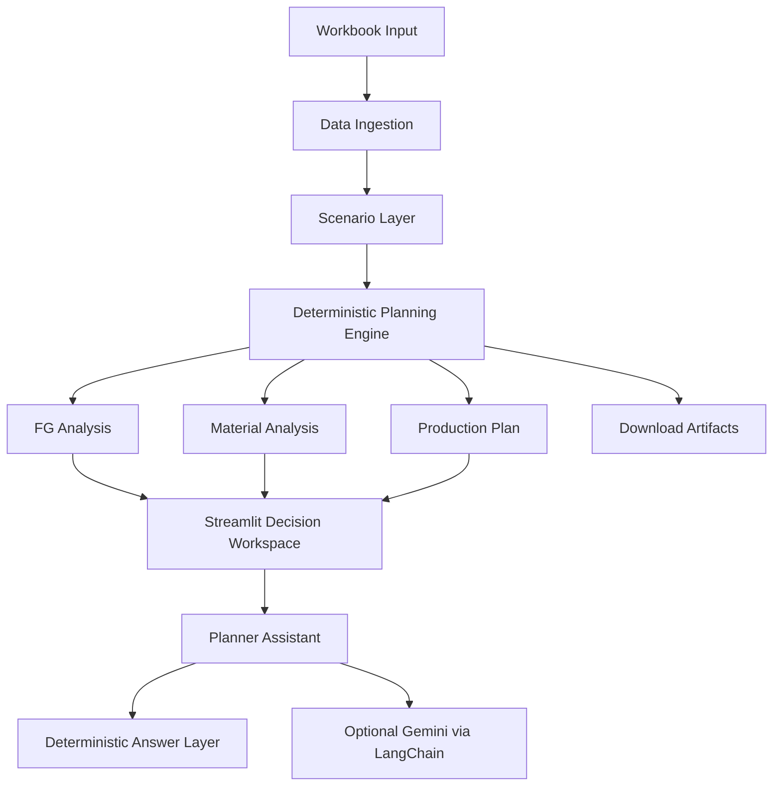

# C&S Electrics Pitch Deck

This document is a client-facing presentation script for `C&S Electrics`. It is designed to help position ForgeBoard as a serious AI-assisted manufacturing planning product backed by a strong engineering and AI team.

Use this as a slide-by-slide deck outline and as your speaker notes.

## Presentation Goal

The goal is not only to show a dashboard.

The goal is to make C&S Electrics feel that:

- you understand their manufacturing planning problem deeply
- the solution is practical, not experimental
- the AI layer is grounded and enterprise-safe
- your team can take this from pilot to production

## Positioning Rule

Do not pitch ForgeBoard as:

- just a dashboard
- just a chatbot
- just an Excel automation tool

Pitch ForgeBoard as:

`An AI-assisted production feasibility and material-prioritization system for faster, more explainable manufacturing decisions.`

---

## Slide 1. Title Slide

### Slide title

`ForgeBoard for C&S Electrics`

### Subtitle

`AI-assisted Production Feasibility, Material Prioritization, and Planner Decision Support`

### What to say

`Today we are showing a practical AI-assisted planning system designed to convert your existing workbook-driven process into a faster, more explainable daily decision workflow.`

`The objective is simple: given demand, BOM, and inventory, help your team know what can be built now, what is blocked, what can be partially fulfilled, and what should be prioritized first.`

---

## Slide 2. The Business Problem

### Slide title

`The Planning Gap`

### Slide content

- demand exists in Excel, but decision logic is still manual
- BOM data exists, but impact across finished goods is hard to see quickly
- inventory exists, but shortage pressure is not decision-ready
- planners spend time reconciling sheets instead of making decisions
- procurement sees shortages, but not always what matters most first
- management sees reports, but not an explainable action view

### What to say

`The real issue is not data availability. The issue is decision latency.`

`Teams already have demand, BOM, and stock data. But turning that into a trusted answer like what can be produced, what percentage of demand can be fulfilled, and what should be procured first is still too manual.`

---

## Slide 3. Why This Matters to C&S Electrics

### Slide title

`Why This Problem Is Expensive`

### Slide content

- delayed production decisions
- avoidable manual planner effort
- reactive procurement
- missed visibility into partial-order fulfillment
- difficult prioritization across competing finished goods

### What to say

`When this process remains spreadsheet-driven, the cost is not only time. It also creates slower response to shortages, inconsistent prioritization, and weaker visibility into what can still be delivered even when full demand cannot be met.`

`That is where ForgeBoard changes the workflow.`

---

## Slide 4. Our Solution

### Slide title

`What ForgeBoard Does`

### Slide content

1. reads demand, BOM, and on-hand inventory from the workbook
2. calculates net demand after FG on-hand stock
3. explodes BOM requirements and detects shortages
4. computes max producible and recommended build by FG
5. shows fulfillment percentage for every FG
6. identifies limiting and blocking materials
7. ranks procurement pressure and material importance
8. explains the result through a grounded planner assistant

### What to say

`ForgeBoard converts the workbook into a decision engine.`

`Instead of asking planners to interpret multiple sheets manually, the system produces a direct answer on finished goods, materials, fulfillment, and priority.`

---

## Slide 5. What Makes This More Than a Dashboard

### Slide title

`This Is a Decision System, Not a Reporting Screen`

### Slide content

- deterministic production logic
- scenario controls for demand and procurement simulation
- explainable FG and material decisions
- planner-facing workflow with exports
- natural-language assistant on top of the scenario

### What to say

`A normal dashboard shows the data. ForgeBoard takes a position on the data.`

`It tells the team what can be built, what is stopping production, what can be partially fulfilled, and which actions matter most right now.`

---

## Slide 6. The AI Story

### Slide title

`Where AI Adds Value`

### Slide content

#### Deterministic engine

- BOM explosion
- inventory matching
- shortage calculation
- max producible logic
- prioritization logic

#### AI layer

- planner Q&A
- business-language explanation
- grounded scenario interpretation
- future forecasting and recommendation extensions

### What to say

`We intentionally separated core manufacturing logic from the AI layer.`

`The engine calculates the answer using deterministic business logic. The AI layer makes the system easier to query, easier to explain, and easier to scale into future recommendation capabilities.`

`This is important because enterprise clients do not want black-box AI deciding production truth. They want AI on top of trustworthy planning logic.`

---

## Slide 7. Why This Shows a Strong AI Team

### Slide title

`Why This Demonstrates Real AI Engineering`

### Slide content

- grounded AI, not generic chatbot behavior
- deterministic fallback when LLM output is weak or unavailable
- structured question interpretation for FG and material queries
- explainable answers tied to scenario data
- modular architecture ready for future integrations

### What to say

`A strong AI team does not just add a chatbot to a dashboard.`

`A strong AI team designs a reliable system where deterministic logic remains the source of truth, the LLM is grounded in live scenario context, and unsafe or generic responses fall back safely.`

`That is the difference between demo AI and deployable AI.`

---

## Slide 8. Live Product Experience

### Slide title

`Planner Workspace`

### Slide content

- `Overview`: executive production posture and decision snapshot
- `Finished Goods`: FG-level fulfillment, blockers, shortages, and covered components
- `Materials`: shortage pressure, procurement ranking, material importance, and enough-stock materials
- `Assistant`: planner questions on top of the live scenario
- `Downloads`: handoff artifacts for planning, procurement, and management

### What to say

`The application is designed as a working planner cockpit, not a technical prototype.`

`It gives management a fast summary, planners a diagnosis workspace, procurement a ranked material view, and all teams exportable outputs.`

---

## Slide 9. Key Screens to Demonstrate

### Slide title

`What We Will Show Live`

### Slide content

1. scenario controls in the sidebar
2. overview posture and fulfillment percentages
3. one FG drill-down with blocker reasons
4. material pressure and procurement ranking
5. assistant question answering
6. downloads and artifact handoff

### Demo script

#### Step 1

Show the workbook input and scenario controls.

Say:

`We start from the same workbook structure your team already uses, but we convert it into a reusable decision workflow.`

#### Step 2

Show `Overview`.

Say:

`This gives management a high-level answer: what is buildable, what is blocked, and what percentage of demand can be fulfilled right now.`

#### Step 3

Show `Finished Goods`.

Say:

`At FG level, the system shows not only whether the item is blocked, but exactly which raw materials are causing the constraint and how much of the demand can still be met.`

#### Step 4

Show `Materials`.

Say:

`This view is where planning and procurement align. It shows both shortage urgency and strategic material importance.`

#### Step 5

Show `Assistant`.

Say:

`This is where AI helps the user interact with the planning result in natural language, without replacing the core production logic.`

#### Step 6

Show `Downloads`.

Say:

`The output is not locked in the UI. It can be handed off immediately through structured artifacts for other teams.`

---

## Slide 10. Architecture Overview

### Slide title

`Solution Architecture`

### What to say

`The architecture is intentionally layered.`

`Workbook ingestion and scenario preparation feed a deterministic planning engine. The UI, downloads, and assistant all sit on top of the same planning result. That means there is one planning truth across all user interactions.`

---

## Slide 11. How the AI Layer Is Controlled

### Slide title

`Safe, Grounded AI Design`

### Slide content

- question is interpreted against known FG and component entities
- deterministic answer is produced first
- Gemini is optional, not mandatory
- Gemini receives structured scenario context
- weak or ungrounded answers fall back safely

### What to say

`This matters in enterprise environments.`

`We do not allow a free-form LLM to invent planning answers. The model is used as a grounded explanation layer on top of deterministic engine output.`

---

## Slide 12. Business Value

### Slide title

`Expected Business Impact`

### Slide content

- faster planning cycle
- quicker blocker identification
- better visibility into partial fulfillment
- clearer procurement action ranking
- more consistent FG prioritization
- reduced manual spreadsheet dependency

### What to say

`The immediate value is not abstract AI. The immediate value is faster and better daily planning decisions.`

`The long-term value is that the same foundation can evolve into a broader planning platform.`

---

## Slide 13. Why We Can Deliver This

### Slide title

`Why Our Team Is Strong for This Project`

### Slide content

- we understand both workflow design and planning logic
- we separate deterministic business logic from AI explanation
- we build explainable systems, not opaque demos
- we design for extensibility from day one
- we can move from pilot to integration roadmap

### What to say

`What we are showing is not only UI polish. It is a disciplined system design approach.`

`That is why we believe we are the right team to build this with C&S Electrics: we are combining product thinking, manufacturing logic, and practical AI engineering.`

---

## Slide 14. Roadmap

### Slide title

`How This Can Scale`

### Slide content

#### Phase 1

- workbook-driven decision cockpit
- planner assistant
- exports for planning and procurement

#### Phase 2

- ERP integration
- scheduled daily runs
- scenario history and comparison

#### Phase 3

- forecasting
- lead-time-aware recommendations
- supplier intelligence
- role-based enterprise workflow

### What to say

`We are not presenting a dead-end prototype. We are presenting a foundation that can scale in controlled phases.`

---

## Slide 15. Closing

### Slide title

`Closing Message`

### What to say

`ForgeBoard shows how C&S Electrics can move from workbook-based planning review to an explainable AI-assisted decision workflow.`

`It is practical enough to use now, structured enough to integrate later, and designed in a way that keeps business logic trustworthy while still using AI where it adds real value.`

`We would like to take this forward as a focused pilot and turn this into a production-ready planning capability for your team.`

---

## Presentation Style Notes

Use this tone in the meeting:

- calm
- confident
- practical
- business-first
- technically credible

Do not overuse these words:

- disruption
- revolutionary
- magical
- fully autonomous

Prefer these phrases:

- explainable
- grounded
- production-feasible
- planner-facing
- decision support
- scenario-driven
- enterprise-safe

## What Will Impress the Client Most

If time is limited, emphasize these points:

1. `This is not generic AI. The engine calculates the truth and AI explains it.`
2. `The system shows partial fulfillment, not only blocked vs not blocked.`
3. `Procurement and planning are connected in one workflow.`
4. `The architecture is already modular enough for API and ERP integration later.`
5. `The assistant is grounded and fallback-safe.`

## Questions You Should Be Ready For

### Can this work with our actual workbook?

Answer:

`Yes, as long as the workbook preserves the required planning sheets and consistent item coding. The current architecture is already designed around workbook ingestion and can be adapted further for your exact operational format.`

### Is the AI making the planning decision?

Answer:

`No. The planning decision is calculated by deterministic business logic. AI is used as a grounded explanation and interaction layer on top of that logic.`

### Can this integrate with ERP later?

Answer:

`Yes. The current Streamlit product is the planner-facing layer, but the engine and workflow design already support moving toward API and scheduler-based integration.`

### Can procurement use this directly?

Answer:

`Yes. The Materials view and export artifacts are already structured for procurement prioritization and shortage analysis.`

### What happens if the model gives a bad answer?

Answer:

`The assistant falls back to deterministic planner answers. The LLM is not allowed to become the only source of truth.`

## Final Advice

If you want the client to feel your AI team is strong, do not try to sound flashy.

Sound controlled.

Show that:

- you understand the manufacturing problem
- you understand the system design
- you understand where AI is useful
- you also understand where AI must be constrained

That combination is what makes teams look credible in front of enterprise clients.
