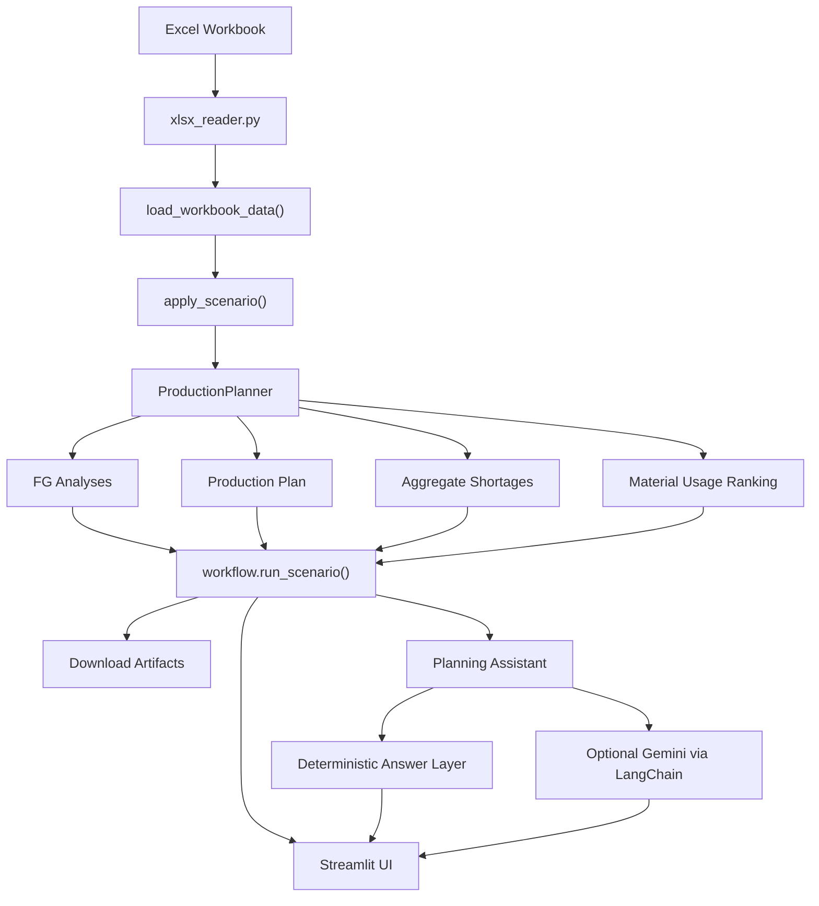
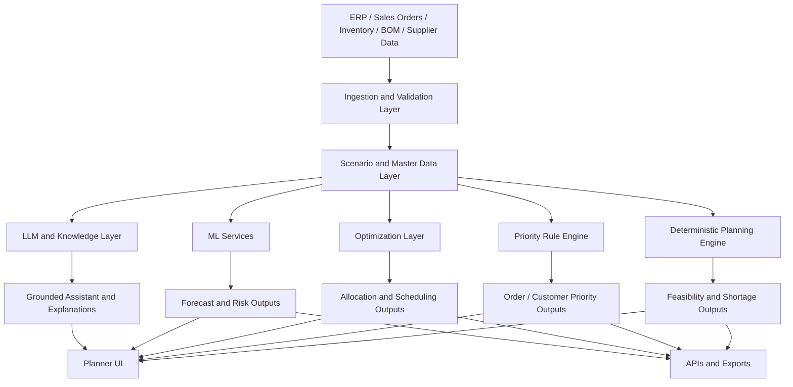
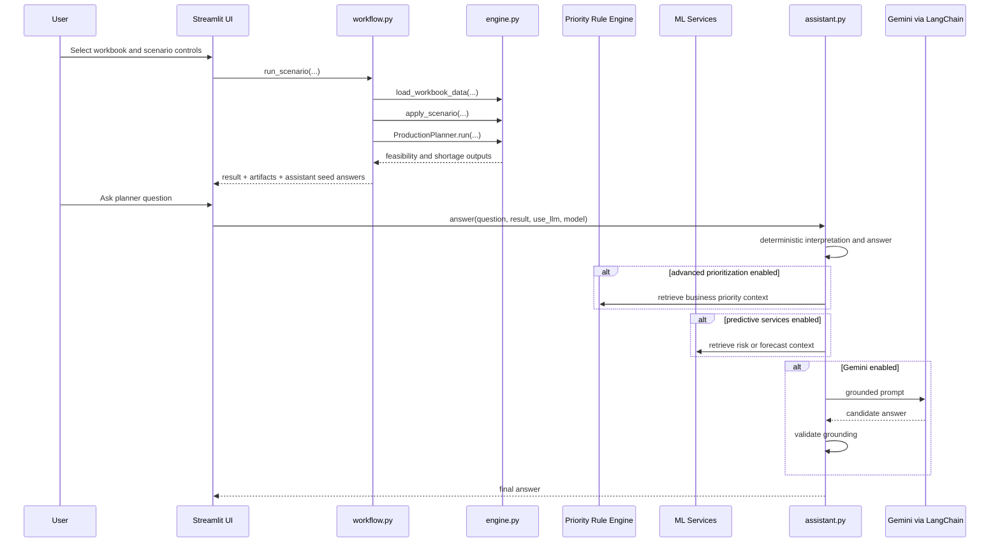

# ForgeBoard Solution Blueprint

This document is the consolidated business and technical blueprint for `ForgeBoard`.

It is intentionally broader than the current UI. The purpose is to describe:

- the manufacturing planning problems ForgeBoard can solve
- the current solution already implemented
- the larger solution space that can be built on top of the same foundation
- the AI, ML, optimization, and prioritization methods that can be used
- the target architecture for an enterprise rollout

## 1. Executive Summary

`ForgeBoard` is an AI-assisted production feasibility, material-prioritization, and planner decision-support platform built on top of the internal Python package `bom_ai_engine`.

At its core, ForgeBoard converts operational data into planning decisions:

- what finished goods can be built now
- how much of each demand line or order can be fulfilled
- which materials are blocking production
- which materials procurement should prioritize
- which orders, customers, or items should be prioritized first
- how the answer changes under demand, procurement, and business-priority scenarios

The current product already provides:

- deterministic planning logic
- planner-facing dashboard UX
- downloadable planning artifacts
- grounded conversational assistance

The larger solution vision is broader:

- customer-aware and order-aware prioritization
- SLA and dispatch-risk prediction
- procurement and lead-time intelligence
- scenario simulation and recommendation
- API and ERP-integrated planning workflows
- future machine learning and optimization services

## 2. Business Problem Landscape

Most manufacturing organizations already have data, but the decision process remains fragmented.

The usual sources exist:

- demand or sales orders
- BOM structures
- on-hand inventory
- procurement plans
- customer commitments
- manual planner judgment

The real business problem is that these inputs are not converted into a single, explainable operational answer fast enough.

### 2.1 Core Operational Problems

Common day-to-day planning problems include:

- net demand is not consistently adjusted for finished-good stock already available
- BOM explosion exists, but shared component pressure across many finished goods is hard to see quickly
- inventory is visible, but true material bottlenecks are not obvious
- planners cannot instantly tell how much of demand can still be fulfilled when full fulfillment is impossible
- procurement teams know shortages exist, but not always which ones matter most first
- management receives reports, but not a direct decision view
- manual scenario testing requires editing multiple Excel rows repeatedly
- planning logic depends too heavily on individual spreadsheet skill

### 2.2 Customer and Commercial Problems

A stronger planning platform must also address these business realities:

- some customers are strategically more important than others
- some sales orders have tighter dispatch commitments or stronger SLA penalties
- some items are service-critical or project-critical
- some orders carry higher revenue, higher margin, or contractual priority
- some customers need partial fulfillment visibility, not only yes/no feasibility
- planning teams need to know which customer or sales order will be affected first if a component goes short

### 2.3 Procurement and Supply Problems

The material problem is not only shortage detection.

It also includes:

- which shortages are operationally urgent vs strategically important
- which materials are shared across many finished goods
- which procurements unlock the most finished-good output
- which vendors or materials have volatile lead times
- where alternate materials or substitute BOM paths may exist
- where future stockout risk is forming even before a current shortage appears

### 2.4 Advanced Planning Problems

Beyond the current feature set, the same foundation can solve:

- sales-order-level allocation
- customer-order promise analysis
- finite-capacity scheduling
- line-level or shift-level production sequencing
- plant or warehouse balancing
- service-level risk detection
- backlog aging and dispatch prioritization
- multi-objective planning across volume, revenue, customer importance, and shortage recovery

### 2.5 Core Problem Statement

The complete business question is:

`Given demand, sales orders, BOM, inventory, customer priorities, item priorities, and supply constraints, what should be produced first, what can be fulfilled partially or fully, what is blocked, what should be procured, and what action creates the highest business impact next?`

## 3. Solution Vision

ForgeBoard turns the workbook and planning inputs into a decision system instead of a file-review exercise.

The solution vision is to create a platform that can:

- ingest operational data repeatedly and reliably
- calculate deterministic production feasibility
- explain fulfillment and shortage impact clearly
- support order-, customer-, and item-aware prioritization
- simulate demand and procurement scenarios
- produce exports for planning, procurement, management, and audit
- expose the same planning truth through UI, API, and conversational interfaces
- add predictive and optimization layers over time without breaking the deterministic core

## 4. What ForgeBoard Solves Today

The current implementation already supports:

- workbook ingestion from `Demand`, `BOM Explode`, and `On-hand Qty`
- finished-good on-hand adjustment and net demand calculation
- FG-level max producible and recommended build logic
- fulfillment percentage visibility
- limiting and blocking component detection
- aggregate material shortage calculation
- raw-material importance ranking by use
- materials already available in enough quantity
- scenario controls for demand multiplier and procurement overrides
- optional business-aware priority hints
- grounded planner Q&A through the assistant
- grouped downloads for planning artifacts

## 5. Full Addressable Solution Space

The product should not be presented as limited only to the current UI. The same architecture can be extended into a broader manufacturing intelligence platform.

### 5.1 Order and Customer Planning

Possible future capabilities:

- sales-order-level prioritization
- promised-date and requested-date prioritization
- customer-tier-based prioritization
- strategic account handling
- project-order vs stock-order balancing
- partial-order commitment recommendations
- order split and allocation logic
- SLA breach-risk visibility

### 5.2 Item and Business Prioritization

Possible future capabilities:

- item criticality ranking
- service-part priority
- high-runner item protection
- new-product-launch prioritization
- customer-specific item priority
- manual executive override logic
- revenue, margin, or penalty-aware prioritization

### 5.3 Procurement Intelligence

Possible future capabilities:

- buy-first recommendations
- shortage recovery impact analysis
- lead-time-aware procurement ranking
- alternate sourcing suggestions
- supplier risk scoring
- planned receipt simulation
- procurement budget optimization

### 5.4 Capacity and Scheduling

Possible future capabilities:

- machine and line capacity constraints
- shift calendars
- routing-aware production feasibility
- sequence optimization
- setup-time minimization
- overtime simulation

### 5.5 Predictive and Intelligent Extensions

Possible future capabilities:

- demand forecasting
- stockout prediction
- order-delay prediction
- supplier lead-time prediction
- anomaly detection in demand or inventory
- recommendation engines for action prioritization

## 6. Users and Decision Personas

Primary users:

- production planners
- procurement teams
- plant managers
- operations leadership
- customer service and order-commit teams

Secondary users:

- supply-chain analysts
- ERP or IT integration teams
- business heads reviewing strategic priorities

Typical decision personas include:

- planner asking what can be built today
- procurement user asking what to buy first
- manager asking which FG or customer is most at risk
- customer service user asking what can still be promised now
- leadership asking how a procurement action changes fulfillment

## 7. Data Foundation

### 7.1 Current Required Inputs

ForgeBoard currently expects:

- `Demand`
- `BOM Explode`
- `On-hand Qty`

Business meaning:

- `Demand`: finished-good requirement and FG on-hand stock
- `BOM Explode`: component structure and per-FG quantity
- `On-hand Qty`: available inventory by item code

### 7.2 Future Optional Inputs

To support the broader solution space, ForgeBoard can be extended to ingest:

- sales order number
- sales order line number
- customer code
- customer segment or tier
- requested dispatch date
- promised date
- order age
- item family
- item criticality class
- service-part flag
- project code
- expedite flag
- order value
- margin
- SLA class
- penalty risk
- vendor lead time
- supplier score
- open purchase orders
- planned receipts
- machine capacity calendars
- line routing data
- alternate BOM or substitute item data

### 7.3 Data Quality Requirements

Minimal data quality expectations:

- FG and component codes must be consistent
- numeric quantities must be parseable
- BOM structure must be reliable enough for material planning
- customer and order master data must map cleanly if advanced priority is introduced

## 8. End-to-End Operating Model

The current operating model is:

1. User selects the sample workbook or uploads a live workbook.
2. User adjusts scenario controls such as demand multiplier, procurement overrides, priority hints, and assistant settings.
3. ForgeBoard reads the workbook and normalizes the tables.
4. The planning engine applies scenario changes.
5. FG feasibility, shortages, and fulfillment percentages are calculated.
6. Finished goods are prioritized.
7. Material pressure and material usage rankings are built.
8. The UI exposes executive, FG, material, assistant, and download views.
9. Optional questions are answered through deterministic logic and, if enabled, Gemini.
10. Outputs are exported as JSON, CSV, and Markdown artifacts.

The expanded future operating model can become:

1. ERP, order, inventory, and supplier data are ingested automatically.
2. The engine computes material feasibility and order fulfillment risk.
3. Priority rules and optimization logic allocate inventory to orders and customers.
4. Predictive models flag future risk.
5. The UI and API expose recommended action plans.
6. Procurement and planning teams collaborate around the same scenario.

## 9. Solution Architecture

### 9.1 Current Architecture



### 9.2 Target Enterprise Architecture



## 10. Logical Architecture Layers

### 10.1 Data Ingestion Layer

Key module today:

- `bom_ai_engine/xlsx_reader.py`

Responsibilities:

- read workbook sheets
- normalize raw rows
- prepare structured input for planning

Future extension:

- ERP connectors
- database ingestion
- scheduled ingestion pipelines

### 10.2 Scenario Preparation Layer

Key functions today:

- `load_workbook_data(...)`
- `apply_scenario(...)`

Responsibilities:

- normalize demand, BOM, and inventory
- apply demand multipliers
- apply procurement overrides

Future extension:

- apply sales-order or customer scenarios
- apply service-level scenarios
- apply supplier receipt scenarios

### 10.3 Deterministic Planning Engine Layer

Key module today:

- `bom_ai_engine/engine.py`

Responsibilities:

- compute net demand
- derive component requirements
- calculate shortages
- compute max producible and recommended build
- identify limiting and blocking components
- allocate production against shared inventory
- build aggregate shortage and material-usage outputs

Future extension:

- order-level allocation
- customer-level allocation
- ATP and CTP style promise logic
- substitute-material evaluation
- capacity-aware planning

### 10.4 Priority Rule Engine Layer

This is the layer that should hold business ranking logic once advanced prioritization is introduced.

Possible responsibilities:

- customer tier priority
- sales-order priority
- item criticality priority
- project priority
- manual executive override priority
- SLA and penalty priority
- region or channel priority

Recommended implementation styles:

- deterministic weighted scoring
- policy-rule engine
- hard-priority bucket logic
- hybrid score plus optimization

### 10.5 Optimization Layer

This layer becomes important when the problem moves from simple ranking to best-allocation decisions.

Possible responsibilities:

- inventory allocation across orders
- limited-material allocation
- line and machine scheduling
- procurement budget allocation
- setup-aware production sequencing

Recommended methods:

- linear programming
- mixed-integer linear programming
- constraint programming
- heuristic and metaheuristic allocation

### 10.6 ML Services Layer

This layer is for predictive decision support, not for replacing deterministic planning truth.

Possible responsibilities:

- demand forecast
- lead-time prediction
- stockout risk prediction
- delay-risk prediction
- anomaly detection
- recommendation scoring

### 10.7 LLM and Knowledge Layer

This layer is for explanation, workflow support, and knowledge interaction.

Possible responsibilities:

- grounded planner Q&A
- SOP and planning-policy question answering
- scenario explanation in business language
- action-summary generation
- executive reporting narrative generation

### 10.8 Presentation and Integration Layer

Current presentation layer:

- `streamlit_app.py`

Future integration channels:

- internal web app
- APIs
- scheduler-driven reports
- ERP-connected services
- role-specific dashboards

## 11. Core Planning Logic

The current planning logic is deterministic and explainable.

### 11.1 Net Demand

```text
Net Demand = max((Demand Qty x demand_multiplier) - FG On-hand Qty, 0)
```

### 11.2 Max Producible

For each component in an FG BOM:

```text
possible units = available_qty / qty_per_fg
```

Then:

```text
Max Producible = floor(min(possible units across required components))
```

### 11.3 Recommended Build

```text
Recommended Build = min(Max Producible, floor(Net Demand))
```

### 11.4 Fulfillment Percentage

```text
Fulfillment % = Recommended Build / floor(Net Demand)
```

Special case:

```text
If Net Demand == 0, Fulfillment % = 1.0
```

### 11.5 Limiting Components

These are the components with the lowest `possible units` value for the FG.

### 11.6 Blocking Components

These start with limiting components and then add major FG-specific shortage lines to create a planner-facing shortlist.

### 11.7 Aggregate Material Shortage

```text
Shortage Qty = max(Required Qty - Available Qty, 0)
```

across the total scenario demand.

### 11.8 Current Priority Score

The FG ranking score currently uses a combination of:

- fulfillment strength
- demand signal
- BOM efficiency
- scarcity
- optional business priority hints
- optional margin score
- optional service-level weight

This balances operational feasibility and business guidance.

### 11.9 Extended Prioritization Framework

A stronger enterprise rollout should support multi-layer prioritization.

Recommended prioritization model:

1. Hard rules
2. Weighted business score
3. Optimization under constraints

#### Hard rules

Use hard rules for cases where business policy should override score tradeoffs:

- mandatory service-part orders
- regulatory or contractual commitments
- VIP or strategic customer buckets
- manual leadership override
- project-critical dispatches

#### Weighted business score

Use a score when multiple feasible orders or items compete for the same materials.

Example advanced score:

```text
Priority Score =
  w1 x fulfillment_feasibility
  + w2 x sla_risk
  + w3 x customer_priority
  + w4 x sales_order_priority
  + w5 x item_priority
  + w6 x project_priority
  + w7 x margin_or_value
  + w8 x shortage_recovery_gain
  + w9 x manual_client_override
```

This does not need to be a single global formula forever. Different business units can use different weighting profiles.

### 11.10 Priority Dimensions ForgeBoard Can Support

ForgeBoard can be extended to rank by:

- sales order priority
- customer priority
- item priority
- customer-item combination priority
- order age
- requested dispatch date
- promised date
- SLA breach risk
- revenue or margin value
- penalty exposure
- project code priority
- service-part criticality
- manual planner or client override

### 11.11 Sales-Order Prioritization

A future sales-order-aware mode can work like this:

- explode demand by order line instead of only by FG
- calculate fulfillment feasibility per order
- allocate limited material across order lines
- rank order lines by dispatch promise, SLA, customer importance, value, and urgency

Possible outputs:

- fully fulfillable orders
- partially fulfillable orders
- blocked orders
- order lines at SLA risk
- best allocation recommendation

### 11.12 Customer Prioritization

A future customer-aware mode can use:

- customer tier
- strategic account flag
- channel importance
- project importance
- SLA commitment class
- revenue history
- penalty risk

This can be used either as:

- hard priority buckets
- weight inputs to a score
- optimization constraints

### 11.13 Item Prioritization

A future item-aware mode can use:

- A/B/C item class
- service part flag
- high-runner status
- launch item status
- strategic SKU classification
- commonality across customers

This is especially useful when material is limited and certain items carry disproportionately higher business value.

### 11.14 Manual Client Priority

ForgeBoard should support explicit business overrides because not every priority can be learned from data.

Examples:

- a customer escalation for this week
- a strategic dispatch linked to a site launch
- internal management override
- urgent service replacement requirement

Recommended implementation:

- manual override fields in the scenario input
- clear audit trail of who changed priority and why
- separate visibility between base score and override score

## 12. AI, ML, and Optimization Strategy

The strongest version of ForgeBoard is not "AI everywhere". It is "use the right method for the right planning problem."

### 12.1 Deterministic Rules

Use deterministic logic when:

- BOM math must be exact
- inventory matching must be exact
- shortage calculation must be exact
- fulfillment percentage must be exact
- business policy is explicit

This should remain the system of record for core feasibility.

### 12.2 Optimization Methods

Use optimization when:

- multiple orders compete for the same limited material
- there are capacity constraints
- there are procurement budgets
- there is a need to maximize output, revenue, margin, or SLA compliance subject to constraints

Recommended methods:

| Problem type | Suitable methods |
|---|---|
| inventory allocation | linear programming, mixed-integer programming |
| production scheduling | constraint programming, MILP, heuristics |
| procurement budget allocation | MILP, knapsack-style optimization |
| sequence optimization | heuristics, tabu search, simulated annealing, genetic algorithms |

### 12.3 Machine Learning Methods

Use ML when the answer must be learned from historical patterns rather than directly calculated.

Recommended ML methods by use case:

| Use case | Possible methods |
|---|---|
| demand forecasting | Prophet, ARIMA, XGBoost, LightGBM, LSTM, Temporal Fusion Transformer |
| supplier lead-time prediction | regression, XGBoost, Random Forest, CatBoost |
| stockout risk prediction | logistic regression, XGBoost, LightGBM |
| order-delay prediction | classification models, survival analysis |
| anomaly detection in demand or inventory | Isolation Forest, One-Class SVM, autoencoders |
| customer or item segmentation | k-means, hierarchical clustering |
| recommendation scoring | learning-to-rank, gradient boosting, pairwise ranking |

### 12.4 LLM Methods

Use LLMs when the problem is about language, explanation, interpretation, or interaction.

Recommended LLM methods:

| Use case | Suitable LLM method |
|---|---|
| planner Q&A on a scenario | grounded prompting with structured scenario context |
| policy and SOP question answering | retrieval-augmented generation |
| explanation of shortages and priorities | templated grounding plus LLM refinement |
| executive summary generation | structured summarization |
| action-plan generation | constrained prompting with structured outputs |
| assistant workflows | tool calling or function calling |

### 12.5 Retrieval-Augmented Generation

RAG becomes useful when ForgeBoard must answer questions using both live scenario data and enterprise knowledge such as:

- planning SOPs
- procurement policies
- customer service policies
- SLA definitions
- planner playbooks
- supplier agreements

Recommended knowledge sources for RAG:

- policy documents
- process SOPs
- item master descriptions
- customer priority rules
- dispatch rules
- material substitution rules

### 12.6 When to Use Which Method

Recommended decision rule:

- use deterministic logic for material truth
- use rule engines for explicit business policy
- use optimization for constrained best-allocation decisions
- use ML for prediction from history
- use LLMs for explanation, interaction, and knowledge access

That separation is what makes the platform enterprise-safe and scalable.

## 13. Current User Experience

The current Streamlit app is organized into five tabs.

### 13.1 Overview

Purpose:

- executive scenario summary
- FG posture table
- procurement pressure table
- decision snapshot

### 13.2 Finished Goods

Purpose:

- inspect one FG at a time
- review FG on-hand, net demand, max producible, recommended build, and fulfillment percentage
- understand limiting and blocking components
- review exact blocker reasoning
- distinguish shortage components from sufficiently covered components

### 13.3 Materials

Purpose:

- review aggregate shortage pressure
- review procurement ranking
- review material importance by usage
- review materials that already have enough stock

### 13.4 Assistant

Purpose:

- answer planner questions in natural language
- use deterministic answers first
- optionally improve explanation quality with Gemini while remaining grounded

### 13.5 Downloads

Purpose:

- provide grouped planning artifacts
- support handoff without reopening the workbook

## 14. Artifact Strategy

Each run can expose:

- `scenario_summary.json`
- `fg_analysis.csv`
- `production_plan.csv`
- `material_shortages.csv`
- `material_usage_ranking.csv`
- `phase1_report.md`
- `phase2_chat.md`
- `phase2_chat.json`

These artifacts support:

- planner review
- procurement action
- management communication
- technical integration
- audit traceability

Future enterprise artifacts can also include:

- order-allocation files
- customer-risk files
- procurement recommendation files
- SLA breach risk reports
- model explanation summaries

## 15. Assistant and Enterprise-Safe AI Design

The assistant is intentionally not a free-form chatbot.

### 15.1 Current Design Principles

- planner questions map to known business intents
- deterministic answers exist even without Gemini
- LLM responses are grounded in scenario context
- poor or generic model responses fall back safely

### 15.2 Current Assistant Capabilities

- why an FG is blocked
- what can be produced now
- what to procure first
- which material is most important by use
- component-specific stock or shortage detail
- coverage and fulfillment questions
- priority and summary questions

### 15.3 Future Assistant Capabilities

- order-level Q&A
- customer-commit Q&A
- SLA-risk explanation
- purchase recommendation explanation
- scenario comparison explanation
- what-if recommendation workflows
- SOP-aware guided action assistance

## 16. Data and Control Flow



## 17. Module Map

Key project modules today:

- `streamlit_app.py`: Streamlit-first frontend and UX
- `bom_ai_engine/engine.py`: planning logic and scenario calculations
- `bom_ai_engine/workflow.py`: orchestration, metrics, and artifacts
- `bom_ai_engine/assistant.py`: planner question answering
- `bom_ai_engine/langchain_client.py`: Gemini LangChain bridge
- `bom_ai_engine/reporting.py`: Markdown report generation
- `bom_ai_engine/models.py`: typed dataclasses for scenario entities
- `bom_ai_engine/xlsx_reader.py`: workbook sheet loading and table extraction

Likely future modules:

- order-priority engine
- customer-priority engine
- optimization service
- forecasting service
- supplier intelligence service
- enterprise API layer

## 18. Design Decisions

Important current design choices:

- `ForgeBoard` is the product name, while `bom_ai_engine` remains the internal Python package name
- the current product is Streamlit-first
- results and artifacts are generated in memory for the app session
- deterministic planning logic remains the source of truth
- Gemini is optional and explanatory, not authoritative
- the UI intentionally shows both shortage and enough-stock views

Important target design principles:

- one planning truth across UI, exports, and assistant
- clean separation between deterministic logic and AI explanation
- explicit business priority support
- modular architecture for future expansion
- safe fallback behavior for model-assisted features

## 19. Assumptions and Constraints

Current assumptions:

- workbook structure remains consistent
- BOM quantities are reliable enough for feasibility planning
- inventory reflects a current operational snapshot
- the current engine is material-feasibility oriented, not finite-capacity scheduling oriented

Current constraints:

- no direct ERP integration yet
- no persistent run history yet
- no role-based access model yet
- no order-level optimization yet
- no supplier lead-time model yet
- no capacity-aware scheduling layer yet

These are constraints of the current implementation, not limits of the solution concept.

## 20. Delivery Roadmap

### Phase 1: Current Foundation

- workbook-driven planning cockpit
- FG feasibility and shortage logic
- material ranking
- assistant and exports

### Phase 2: Business Priority Expansion

- customer priority
- sales-order priority
- item criticality and service-level priority
- manual override and audit trail
- customer-commit and partial-fulfillment views

### Phase 3: Predictive and Optimization Layer

- forecast services
- delay-risk and stockout-risk models
- procurement recommendation engine
- inventory allocation optimization
- line and capacity constraints

### Phase 4: Enterprise Integration

- ERP and data-pipeline integration
- scheduled runs
- API exposure
- role-based dashboards
- monitoring and governance

## 21. Success Measures

Suggested business success measures:

- planning cycle time reduction
- fewer manual spreadsheet reconciliations
- faster blocker identification
- better visibility into partial-order fulfillment
- more consistent prioritization decisions
- improved procurement action on high-impact materials
- better SLA adherence
- fewer surprises on customer commitments

Suggested technical success measures:

- workbook ingestion reliability
- scenario runtime
- assistant grounding accuracy
- model fallback safety rate
- forecast error for predictive modules
- optimization improvement over manual allocation baseline

## 22. Why This Matters for C&S Electrics

For a manufacturing organization like C&S Electrics, the value is not only a cleaner dashboard.

The value is building a platform that can eventually connect:

- production planning
- procurement prioritization
- customer commitment visibility
- material risk intelligence
- AI-assisted decision support

This matters because the planning challenge is cross-functional.

It affects:

- the plant
- procurement
- customer service
- leadership
- strategic accounts

ForgeBoard is a strong foundation because it starts with deterministic planning truth and can then expand into customer-aware, order-aware, and predictive decision support.

## 23. Recommended Positioning

Recommended client-facing positioning:

`ForgeBoard is an AI-assisted production feasibility, fulfillment, and material-prioritization platform that converts planning inputs into explainable operational decisions.`

Alternative positioning:

`ForgeBoard is a manufacturing decision-support layer that sits between raw operational data and daily planning action.`

Short positioning themes:

- from workbook to decision engine
- from shortage visibility to action prioritization
- from manual planning to explainable operations intelligence
- from reactive planning to AI-assisted planning

## 24. Related Documents

For presentation and view-specific notes, use:

- `docs/client_solution_outline.md`
- `docs/cs_electrics_pitch_deck.md`
- `docs/client_presentation_guide.md`
- `docs/excel_sheets_client_guide.md`
- `docs/overview_tab_guide.md`
- `docs/finished_goods_tab_guide.md`
- `docs/materials_tab_guide.md`
- `docs/sidebar_guide.md`
