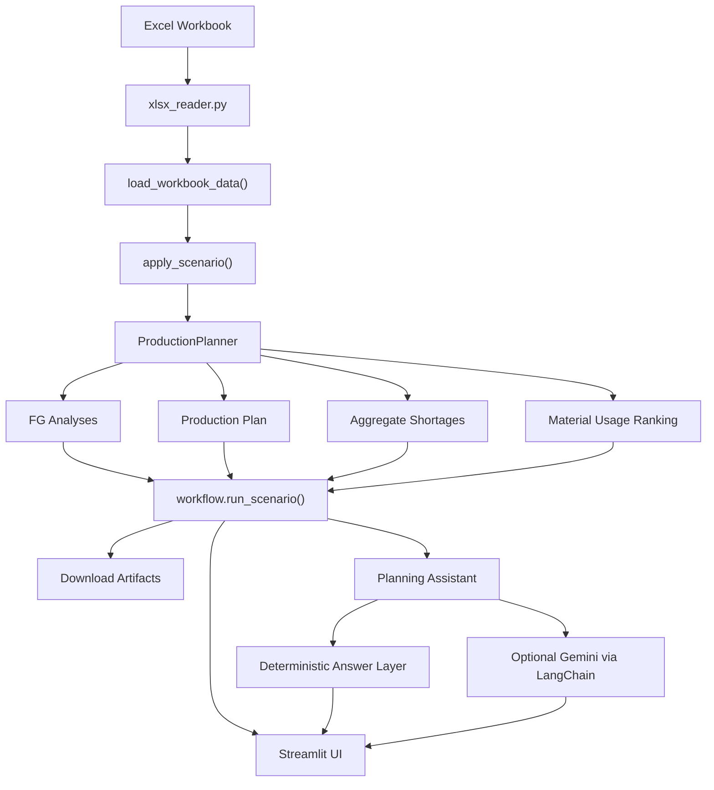
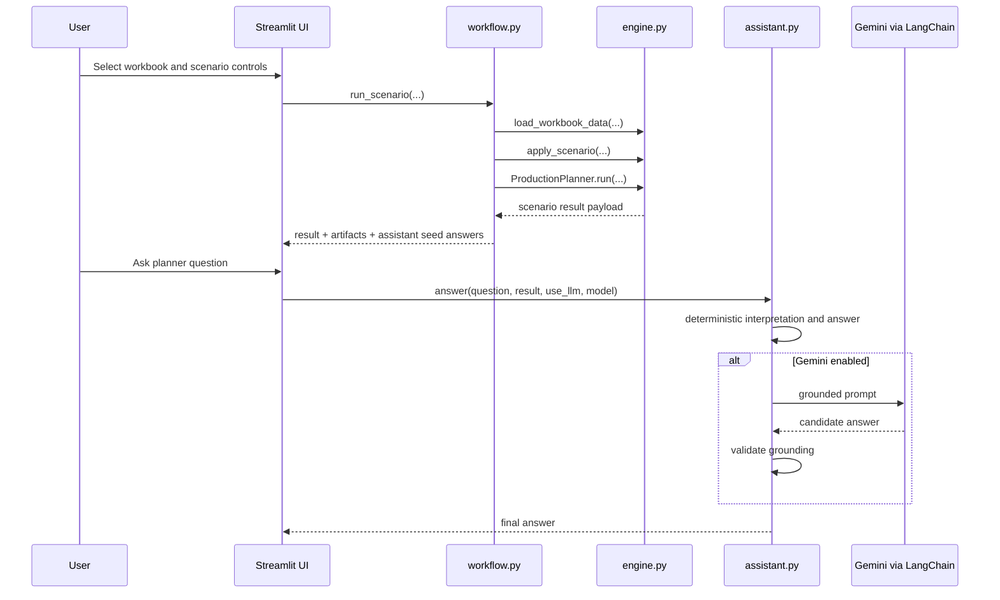

# ForgeBoard Solution Blueprint

This document is the consolidated business and technical overview of `ForgeBoard`. It is intended to capture the full story in one place, from the client problem statement to the current solution design, architecture, delivery model, and future scope.

## 1. Executive Summary

`ForgeBoard` is a Streamlit-based production feasibility cockpit built on top of the internal Python package `bom_ai_engine`.

It converts a client workbook into a repeatable planning workflow that answers:

- what finished goods can be built now
- how much of each order can be fulfilled
- which raw materials are blocking production
- which materials procurement should prioritize
- which finished goods should be prioritized first
- how the answer changes under demand and procurement what-if scenarios

The product combines:

- deterministic planning logic
- planner-facing dashboard UX
- downloadable planning artifacts
- an optional grounded Gemini explanation layer

## 2. Problem Statement

In many manufacturing teams, the production decision is still made manually from Excel exports. The data may exist, but the decision logic is fragmented.

Typical pain points:

- demand is visible, but true net demand after FG on-hand stock is not consistently calculated
- BOM explosion exists, but component-level impact is not easy to interpret quickly
- inventory is available, but shortage pressure across all finished goods is not obvious
- planners cannot immediately tell which FG is actually feasible right now
- procurement teams see shortages, but not always which ones matter most operationally
- prioritization is often based on spreadsheet judgment instead of a consistent rule
- what-if analysis requires manual edits and repeated workbook manipulation
- management gets output tables, not an explainable decision view

So the core business problem is not only reporting. It is decision support:

`Given demand + BOM + inventory, what can we make now, what is blocking us, what percentage of demand can be fulfilled, and what should we do next?`

## 3. Solution Vision

ForgeBoard turns the workbook into a planning system instead of a static file review exercise.

The solution vision is:

- ingest the workbook in a repeatable way
- calculate deterministic production feasibility
- expose the answer through a planner-friendly UI
- explain the output in business language
- export artifacts for procurement, operations, and management
- support scenario simulation without changing the source workbook

## 4. Business Objectives

The current product is designed to support these outcomes:

- faster daily production planning
- earlier visibility into bottleneck materials
- clearer procurement action ranking
- explainable FG prioritization
- reduced manual spreadsheet work
- easier communication between planning, procurement, and leadership

## 5. Scope of the Current Product

Current in-scope capabilities:

- workbook ingestion from `Demand`, `BOM Explode`, and `On-hand Qty`
- finished-good net demand calculation
- component shortage calculation
- FG-level max producible and recommended build logic
- limiting and blocking component identification
- FG priority scoring with optional business hints
- scenario controls for demand multiplier and procurement overrides
- materials ranking by shortage and by usage importance
- covered-material views for both FG and material screens
- grounded planner Q&A using deterministic answers with optional Gemini explanation
- export center for JSON, CSV, Markdown, and Q&A artifacts

Current out-of-scope areas:

- direct ERP writeback
- order scheduling by line or shift
- vendor lead-time optimization
- purchase-order automation
- multi-plant balancing
- cost optimization beyond simple priority hints

## 6. Target Users

Primary users:

- production planners
- procurement teams
- operations managers
- plant leadership

Secondary users:

- business analysts
- implementation teams
- technical teams integrating ForgeBoard into a broader workflow

## 7. Source Data Model

ForgeBoard expects a workbook with these sheets:

- `Demand`
- `BOM Explode`
- `On-hand Qty`

Business meaning of each sheet:

- `Demand`: which finished goods need to be supplied and what FG stock already exists
- `BOM Explode`: which components each FG consumes and in what quantity
- `On-hand Qty`: current stock by item code

Minimal required consistency:

- FG codes must match across demand and BOM
- component codes must match across BOM and inventory
- quantities must be numeric and interpretable

## 8. End-to-End Workflow

The current product flow is:

1. User selects the sample workbook or uploads a live workbook.
2. User optionally adjusts demand multiplier, procurement overrides, priority hints, and assistant settings.
3. ForgeBoard reads the workbook and validates the required tables.
4. The planning engine applies scenario changes.
5. FG feasibility is calculated.
6. FGs are scored and ranked.
7. Final production allocation is calculated against shared inventory.
8. Aggregate shortages and material-usage rankings are built.
9. The Streamlit UI renders overview, FG, materials, assistant, and downloads views.
10. Optional assistant questions are answered using deterministic logic and, if enabled, Gemini.
11. Download artifacts are generated in memory and exposed in the Downloads tab.

## 9. Solution Architecture

The current architecture is layered.



## 10. Logical Architecture Layers

### 10.1 Data Ingestion Layer

Key module:

- `bom_ai_engine/xlsx_reader.py`

Responsibilities:

- open workbook sheets
- normalize raw rows into a usable table structure
- provide input to the planning engine

### 10.2 Scenario Preparation Layer

Key functions:

- `load_workbook_data(...)`
- `apply_scenario(...)`

Responsibilities:

- build normalized demand, BOM, and inventory structures
- compute adjusted demand after multiplier
- add simulated procurement quantities to inventory

### 10.3 Planning Engine Layer

Key module:

- `bom_ai_engine/engine.py`

Responsibilities:

- calculate net demand
- derive per-component FG requirements
- determine max producible quantity
- detect shortages
- identify limiting and blocking components
- build FG coverage and fulfillment values
- rank finished goods by priority
- allocate final production against shared inventory
- build aggregate shortages
- build material usage ranking

### 10.4 Workflow and Artifact Layer

Key module:

- `bom_ai_engine/workflow.py`

Responsibilities:

- orchestrate the end-to-end scenario run
- assemble the result payload
- generate CSV, Markdown, and JSON artifacts
- compute top-level summary metrics used in the UI

### 10.5 Assistant Layer

Key modules:

- `bom_ai_engine/assistant.py`
- `bom_ai_engine/langchain_client.py`

Responsibilities:

- interpret planner questions
- answer common planning questions deterministically
- optionally pass grounded context to Gemini through LangChain
- reject ungrounded model responses and fall back safely

### 10.6 Presentation Layer

Key module:

- `streamlit_app.py`

Responsibilities:

- render planner UX
- expose scenario controls
- present summary and drill-down views
- host the assistant
- provide grouped downloadable artifacts

## 11. Core Planning Logic

The planning logic is deterministic and explainable.

### 11.1 Net Demand

```text
Net Demand = max((Demand Qty x demand_multiplier) - FG On-hand Qty, 0)
```

### 11.2 Max Producible

For each component in an FG BOM:

```text
possible units = available_qty / qty_per_fg
```

Then:

```text
Max Producible = floor(min(possible units across required components))
```

### 11.3 Recommended Build

```text
Recommended Build = min(Max Producible, floor(Net Demand))
```

### 11.4 Fulfillment Percentage

```text
Fulfillment % = Recommended Build / floor(Net Demand)
```

Special case:

```text
If Net Demand == 0, Fulfillment % = 1.0
```

### 11.5 Limiting Components

These are the components with the lowest `possible units` value for the FG.

### 11.6 Blocking Components

These start with limiting components and then add the largest FG-specific shortage lines to create a short planner-facing shortlist.

### 11.7 Aggregate Material Shortage

```text
Shortage Qty = max(Required Qty - Available Qty, 0)
```

across the total scenario demand.

### 11.8 Priority Score

The FG ranking score is built from:

- fulfillment / coverage strength
- demand signal
- BOM efficiency signal
- scarcity signal
- optional business priority hints
- optional margin score
- optional service-level weight

This gives ForgeBoard a balance of operational feasibility and business guidance.

## 12. Current User Experience

The Streamlit app is currently organized into five tabs.

### 12.1 Overview

Purpose:

- executive summary of the scenario
- FG posture table
- procurement pressure table
- decision snapshot

### 12.2 Finished Goods

Purpose:

- inspect one FG at a time
- see FG on-hand, net demand, max producible, recommended build, and fulfillment percentage
- understand limiting and blocking components
- review exact blocker reasoning
- separate shortage components from sufficiently covered components

### 12.3 Materials

Purpose:

- understand aggregate shortage pressure
- review procurement ranking
- review raw material importance by usage
- identify materials that already have enough stock

### 12.4 Assistant

Purpose:

- answer planner questions in natural language
- provide deterministic answers first
- optionally improve phrasing with Gemini while staying grounded

### 12.5 Downloads

Purpose:

- provide grouped run artifacts for planning, materials, and assistant outputs
- support handoff without reopening the workbook

## 13. Current Download Artifacts

Each run can expose:

- `scenario_summary.json`
- `fg_analysis.csv`
- `production_plan.csv`
- `material_shortages.csv`
- `material_usage_ranking.csv`
- `phase1_report.md`
- `phase2_chat.md`
- `phase2_chat.json`

These serve different consumers:

- planners
- procurement teams
- management reviewers
- technical integrations

## 14. Assistant Design

The assistant is intentionally not a free-form black box.

Design principles:

- planner questions should map to known business intents
- deterministic answers should be available even without Gemini
- LLM answers must be grounded in scenario data
- poor or generic LLM responses must fall back safely

Current assistant capabilities include:

- why an FG is blocked
- what can be produced now
- what to procure first
- which material is most important by use
- component-specific stock or shortage detail
- coverage and fulfillment questions
- priority and summary questions

## 15. Data and Control Flow



## 16. Module Map

Key project modules:

- `streamlit_app.py`: Streamlit-first frontend and UX
- `bom_ai_engine/engine.py`: planning logic and scenario calculations
- `bom_ai_engine/workflow.py`: orchestration, metrics, and artifacts
- `bom_ai_engine/assistant.py`: planner question answering
- `bom_ai_engine/langchain_client.py`: Gemini LangChain bridge
- `bom_ai_engine/reporting.py`: Markdown planning report generation
- `bom_ai_engine/models.py`: typed dataclasses for scenario entities
- `bom_ai_engine/xlsx_reader.py`: workbook sheet loading and table extraction

## 17. Design Decisions

Important current design choices:

- `ForgeBoard` is the product name, but `bom_ai_engine` remains the internal Python package name
- the product is now Streamlit-first rather than CLI-first
- results and artifacts are generated in memory for the app session
- deterministic planning logic remains the system of record
- Gemini is optional and explanatory, not authoritative
- the dashboard exposes both shortage and enough-stock views to reduce planner ambiguity

## 18. Assumptions and Constraints

Current assumptions:

- workbook structure remains consistent
- BOM quantities are already trustworthy enough for planning use
- inventory reflects a current snapshot, not a real-time feed
- the engine works at a material-feasibility level, not finite-capacity scheduling level

Current constraints:

- no direct ERP integration in the current product
- no persistent run history store
- no multi-user collaboration model
- no role-based access control layer
- no native optimization by lead time, cost, or supplier risk

## 19. Deployment View

Today, the primary delivery model is:

- local or hosted Streamlit app

Reasonable next deployment shapes:

- internal web app for plant teams
- scheduled daily scenario refresh
- API-backed service for ERP or workflow integration
- containerized deployment for enterprise environments

## 20. Success Measures

Suggested business success measures:

- planning cycle time reduction
- fewer manual spreadsheet reconciliations
- faster blocker identification
- more consistent FG prioritization decisions
- improved procurement response on high-pressure materials
- better management visibility into partial-order fulfillment

## 21. Future Scope

Natural next-stage enhancements include:

- ERP or MRP integration for automated data ingestion
- run history, scenario comparison, and audit trail views
- supplier lead-time and purchase recommendation logic
- material criticality scoring using supplier risk and alternate sourcing
- finite-capacity and line-level scheduling
- multi-warehouse or multi-plant inventory balancing
- customer-order level promise analysis
- role-based dashboards for planning, procurement, and leadership
- alerting for newly blocked FGs or sudden material risk
- API endpoints for downstream integration
- stronger admin controls for model selection and prompt policy

## 22. Recommended Positioning

Recommended client-facing positioning:

`ForgeBoard is an AI-assisted production feasibility and material-prioritization cockpit that converts Excel planning inputs into an explainable daily decision workflow.`

Short positioning themes:

- from workbook to decision engine
- from shortage visibility to action prioritization
- from manual review to explainable planning workflow

## 23. Related Documents

For more detailed view-specific notes, use:

- `docs/client_solution_outline.md`
- `docs/client_presentation_guide.md`
- `docs/excel_sheets_client_guide.md`
- `docs/overview_tab_guide.md`
- `docs/finished_goods_tab_guide.md`
- `docs/materials_tab_guide.md`
- `docs/sidebar_guide.md`
